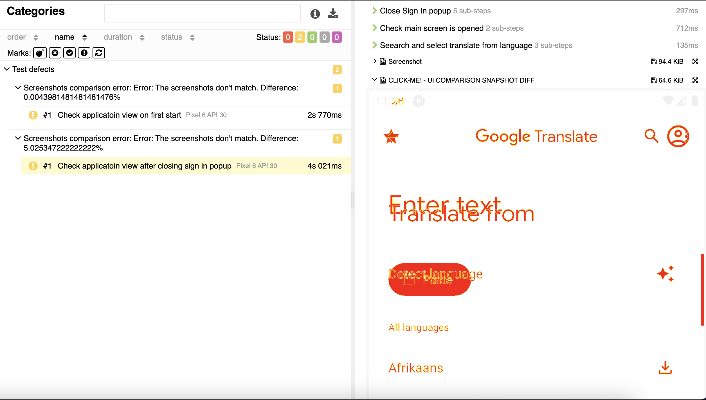
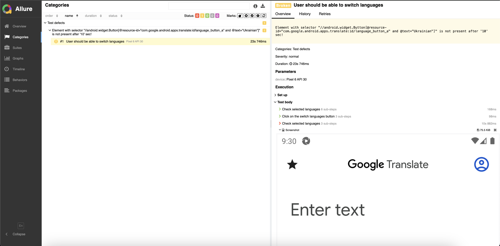
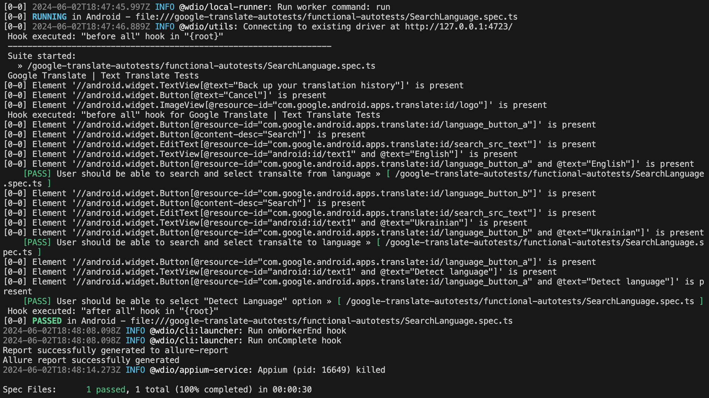

<h1 align="center">Portfolio mobile WebdriverIO project</h1>

<div align="center">
  <a href="https://github.com/jectoric/portfolio-mobile-wdio-prj/actions/workflows/codeql.yml">
    
  </a>
  <a href="https://github.com/jectoric/portfolio-mobile-wdio-prj/actions/workflows/eslint.yml">
    
  </a>
</div>

<p align="center">
  Created to demonstrate mobile test automation skills by checking the functionality and appearance of the <a href="https://play.google.com/store/apps/details?id=com.google.android.apps.translate">Google Translate</a> Android application. It operates on the WebdriverIO automation framework and includes functional and non-functional autotest examples for verifying appearance through screenshot comparisons (UI Regression Tests).
</p>

> [!NOTE]
> There was no goal to cover all functionality and views of Google Translate

***

<p align="center">
  <a href="#features">FEATURES</a> |
  <a href="#structure">STRUCTURE</a> |
  <a href="#setup">SETUP</a> |
  <a href="#built-with">BUILD WITH</a> |
  <a href="#license">LICENSE</a>
</p>

***

## Features 
- **Executing of autotests separatly by suite names** `main screen`, `select language screen` and `all tests`
- **UI Comparison autotests** that allows to compare current view with predefined scrennshot. Differences between screenshots are highlighted in red
<br/>
<div align="center">

</div>
<br/>

- **Allure reports** with screenshot and links to issue that which are created in the description if test contains label `[ISSUE => ]`. Also there is custom allure decodator `@step()` for convinient usage
<br/>
<div align="center">

</div>
<br/>

- **Dividion of wdio.conf settings**, which allows to setup pipelines in different places without conflicts
- **Static code analysis**. `ESLint` and `CodeQL` analysis on push and pull requests
- **Managed log levels**, silent by default. This makes logs readable and tests easy to debug, just indicate the desired log level in `.env` file, like `LOG_LVL=debug`
<br/>
<div align="center">

</div>
<br/>

- **Advanced and easy to use imports**. Instead of importing several screens, just import `ApplicationScreens` via `@screens` import
```
import { ApplicationScreens } from '@screens/ApplicationScreens';

await screens.mainScreen.function();
await screens.searchLanguageScreen.function();
await screens.your_screen.function();
```

## Structure
- `.github` folder - static code analysis pipelines setup
- `config` folder - webdriver and reporter configurations 
- `demo` folder - screenshots for `README.md`
- `docs` folder - for different instructions and rules
- `google-translate-autotests` folder - divided into functional and non-functional autotests
- `screens` folder - selectors and screen functions
- `support` folder - different utils and data for tests
- in `package.json` you can find scripts and dependencies
- in `tsconfig.json` you can find imports setup

## Setup
### 1. Precondition:
- Install typescript from the official website if need
- Downloaded [Node.js and NPM](https://radixweb.com/blog/installing-npm-and-nodejs-on-windows-and-mac)

### 2. Project dependecies setup:
- Install node modules by run command from project root:
```
npm install
```

### 3. Mobile emulator setup
- Install latest release appium server from the [official repo](https://github.com/appium/appium), follow instructions
- Check [instructions](./docs/APPIUM.md) for Appium Inspector setup 
- Install [Android Studio](https://developer.android.com/studio) and create desired device, then write capabilities of created device to `.env` file, that should be located in project root. Example of file:
```
PLATFORM_NAME=Android
DEVICE_NAME=Pixel 6 API 30
PLATFORM_VERSION=11

RETRIES=1 #optional retries on fail number, 0 by default
MAX_INSTANCES=1 #optional parallel runs number, 1 by default
LOG_LVL=silent #optional log level, available 'trace' | 'debug' | 'info' | 'warn' | 'error' | 'silent'
```
### 4. Run tests
1. Open android studio and click on play button for created device
2. Create `app` forlder in project root and add the `.apk` file to it
3. Run decired suite from `pakage.json`, for example `run-functional-autotests`. Or by using command from project root:
```
npm run run-functional-autotests
```

## Built With
- [TypeScript language](https://www.typescriptlang.org/) - Used to write automation test cases.
- [NPM](https://www.npmjs.com/) - For managing project's dependencies, including WebdriverIO and any other libraries required for the automation.
- [WebdriverIO](https://webdriver.io/uk/) - Serves as the core automation framework for the project, enabling the simulation of user interactions and testing scenarios on the web application.
- [Mocha framework](https://github.com/mochajs/mocha) - A JavaScript testing framework that provides flexible and powerful tools for writing and running tests with a convenient interface and extensive customization options.
- [Appium](https://github.com/appium/appium) - An open-source framework for automating mobile app testing across different platforms, allowing tests to be run on iOS, Android, and Windows devices using a unified API.
- [Pixelmatch library](https://github.com/mapbox/pixelmatch) - is utilized for visual regression testing. It allows to compare screenshots of your app UI, detecting any unexpected visual differences.
- [Allure Report](https://webdriver.io/docs/allure-reporter/) - used for generating detailed test reports.

## License
```
MIT License

Copyright (c) 2024 Yevhenii Marchenko

Permission is hereby granted, free of charge, to any person obtaining a copy
of this software and associated documentation files (the "Software"), to deal
in the Software without restriction, including without limitation the rights
to use, copy, modify, merge, publish, distribute, sublicense, and/or sell
copies of the Software, and to permit persons to whom the Software is
furnished to do so, subject to the following conditions:

The above copyright notice and this permission notice shall be included in all
copies or substantial portions of the Software.

THE SOFTWARE IS PROVIDED "AS IS", WITHOUT WARRANTY OF ANY KIND, EXPRESS OR
IMPLIED, INCLUDING BUT NOT LIMITED TO THE WARRANTIES OF MERCHANTABILITY,
FITNESS FOR A PARTICULAR PURPOSE AND NONINFRINGEMENT. IN NO EVENT SHALL THE
AUTHORS OR COPYRIGHT HOLDERS BE LIABLE FOR ANY CLAIM, DAMAGES OR OTHER
LIABILITY, WHETHER IN AN ACTION OF CONTRACT, TORT OR OTHERWISE, ARISING FROM,
OUT OF OR IN CONNECTION WITH THE SOFTWARE OR THE USE OR OTHER DEALINGS IN THE
SOFTWARE.
```
